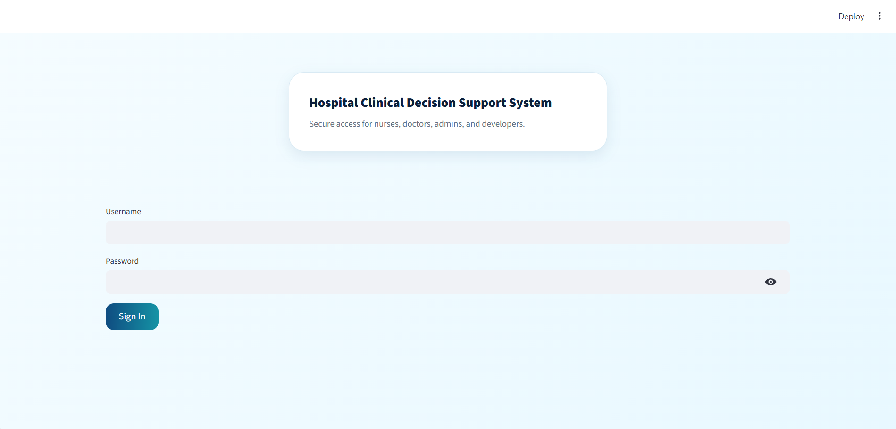
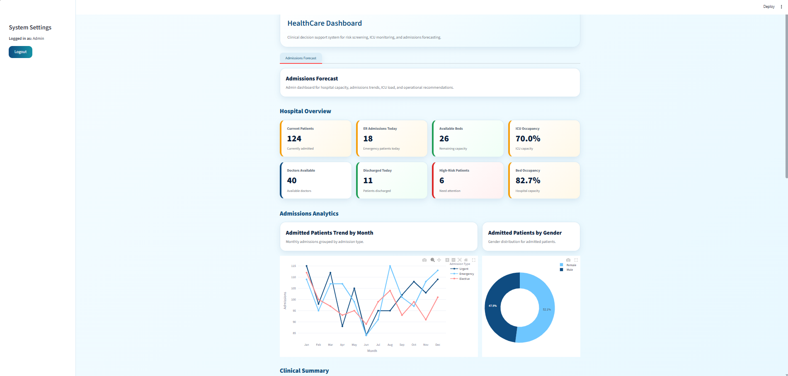
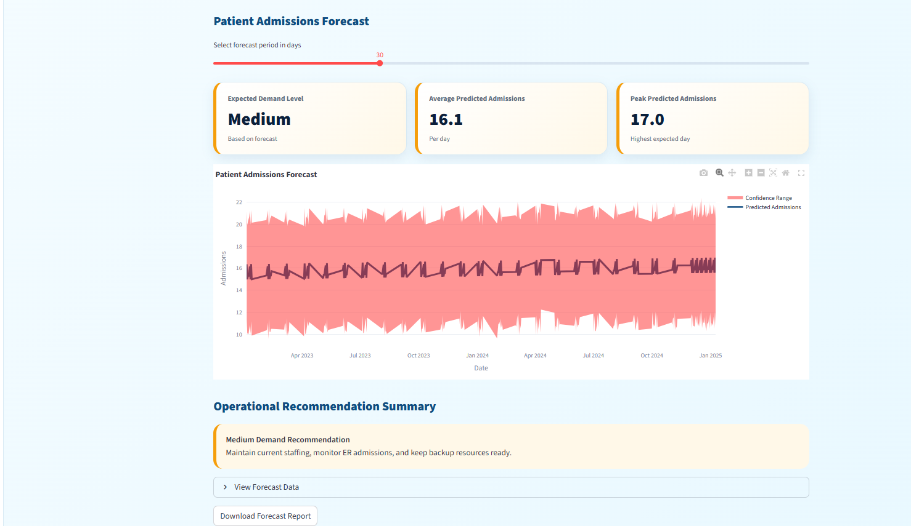

# 🩺 AI-Powered Clinical Decision Support and Patient Monitoring System

An AI-powered healthcare platform designed to support clinical decision-making and monitor ICU patients using machine learning and forecasting techniques.

The system analyzes patient data to predict risk levels, provides interactive dashboards for visualization, and forecasts future hospital admissions to support healthcare resource planning.

---

## ✨ Features

- 🤖 Patient Risk Prediction using Machine Learning
- 📊 Interactive Dashboard built with Streamlit
- 📈 Hospital Admission Forecasting using Prophet
- 📉 Data Visualization with Plotly
- 🧹 Data Preprocessing and Feature Engineering
- 📋 Healthcare Analytics Dashboard

---

## 🛠️ Technologies Used

- Python
- Streamlit
- Pandas
- NumPy
- Scikit-learn
- Prophet
- Plotly
- Matplotlib

---

## 📂 Project Structure

```text
AI-Clinical-Decision-Support-System/
│
├── data/
│   ├── final_risk_dataset.csv
│   └── healthcare_patient_flow_data.csv
│
├── images/
│   ├── login.png
│   ├── dashboard.png
│   ├── monitoring.png
│   ├── forecast.png
│   └── risk.png
│
├── notebooks/
│   └── dataVitals_demo.csv
│
├── app.py
├── generate_data.py
├── requirements.txt
└── README.md
```

---

## 📸 Project Preview

### Login Page



### Dashboard



### Patient Monitoring


### Forecast Dashboard



### Risk Prediction


---

## 🚀 Installation

Clone the repository

```bash
git clone https://github.com/Ghala77-prog/AI-Clinical-Decision-Support-System.git
```

Install the required packages

```bash
pip install -r requirements.txt
```

Run the application

```bash
streamlit run app.py
```

---

## 🎯 Project Goal

The goal of this project is to assist healthcare professionals by combining machine learning, data visualization, and predictive analytics into a single intelligent platform that supports faster and more informed clinical decisions.

---

## 👩‍💻 Author

**Ghala Alharbi**

- GitHub: https://github.com/Ghala77-prog
- LinkedIn: https://www.linkedin.com/in/ghala-alharbi1/
