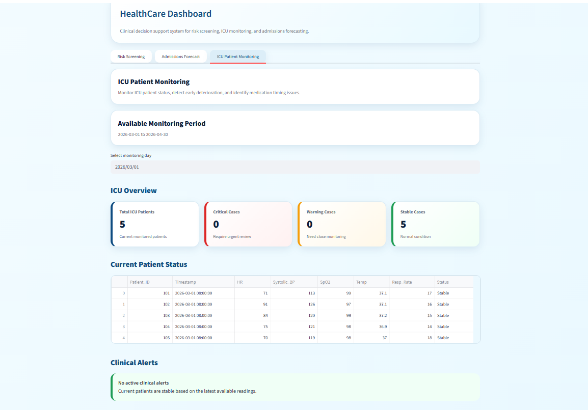
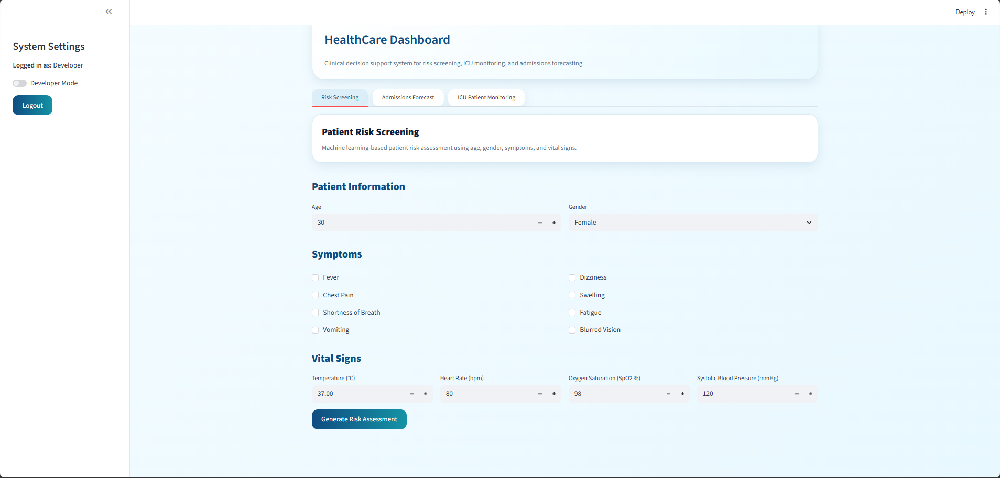
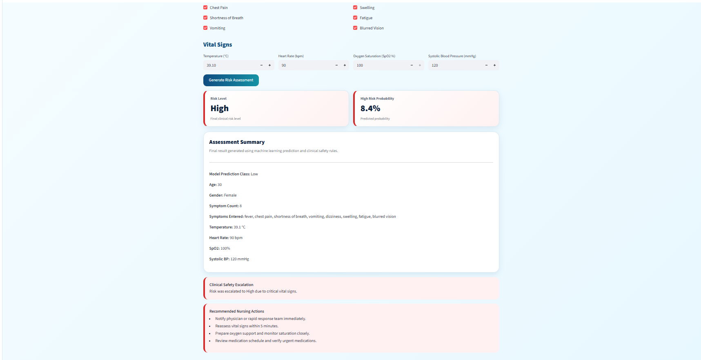
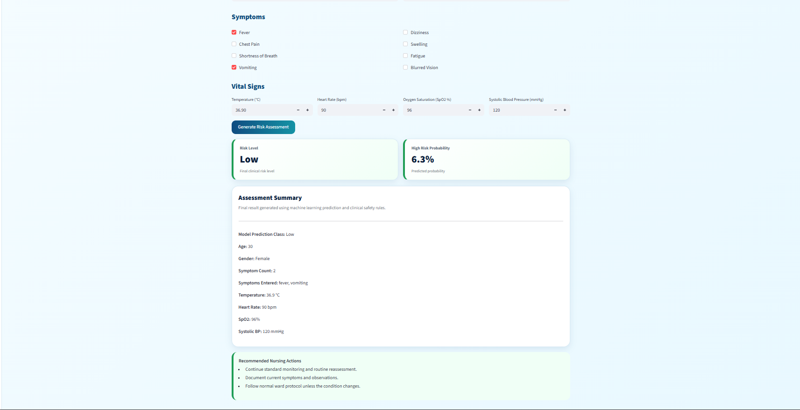

# 🩺 AI-Powered Clinical Decision Support and Patient Monitoring System

> An AI-powered healthcare platform for ICU patient monitoring, clinical decision support, and hospital admission forecasting using Machine Learning and Predictive Analytics.


---

## 📖 About

This project is an AI-powered healthcare platform designed to support clinical decision-making in Intensive Care Units (ICUs).

The system combines Machine Learning, predictive analytics, and interactive dashboards to assist healthcare professionals in monitoring patients, predicting clinical risk levels, and forecasting future hospital admissions for better healthcare resource planning.

---

## ✨ Features

- 🤖 Predict patient risk using Machine Learning models.
- 🩺 Monitor ICU patient health information.
- 📊 Interactive healthcare dashboard built with Streamlit.
- 📈 Forecast future hospital admissions using Prophet.
- 📉 Interactive charts and analytics using Plotly.
- 🧹 Data preprocessing and feature engineering.
- 📋 Healthcare analytics and operational insights.

---

## 🛠️ Technologies Used

- Python
- Streamlit
- Pandas
- NumPy
- Scikit-learn
- Prophet
- Plotly
- Matplotlib

---

## 📂 Project Structure

```text
AI-Clinical-Decision-Support-System/
│
├── data/
│   ├── final_risk_dataset.csv
│   └── healthcare_patient_flow_data.csv
│
├── images/
│   ├── login.png
│   ├── dashboard.png
│   ├── icu_monitoring.png
│   ├── forecast.png
│   ├── risk_prediction.png
│   ├── risk_high.png
│   └── risk_low.png
│
├── notebooks/
│   └── dataVitals_demo.csv
│
├── app.py
├── generate_data.py
├── requirements.txt
└── README.md
```

---

## 📸 Project Preview

### Login Page


---

### Dashboard


---

### ICU Patient Monitoring



---

### Hospital Admission Forecast


---

### Patient Risk Prediction



---

### High Risk Example



---

### Low Risk Example



---

## 🚀 Installation

Clone the repository

```bash
git clone https://github.com/Ghala77-prog/AI-Clinical-Decision-Support-System.git
```

Install the required packages

```bash
pip install -r requirements.txt
```

Run the application

```bash
streamlit run app.py
```

---

## 🎯 Project Goal

The objective of this project is to enhance clinical decision-making by integrating Machine Learning, predictive analytics, and interactive data visualization into a unified healthcare platform.

The system aims to assist healthcare professionals in identifying patient risk levels, monitoring ICU patients, and forecasting hospital admissions to improve operational planning and patient care.

---

## 👩‍💻 Author

**Ghala Alharbi**

- GitHub: https://github.com/Ghala77-prog
- LinkedIn: https://www.linkedin.com/in/ghala-alharbi1/

---

⭐ If you found this project interesting, consider giving it a star on GitHub.
